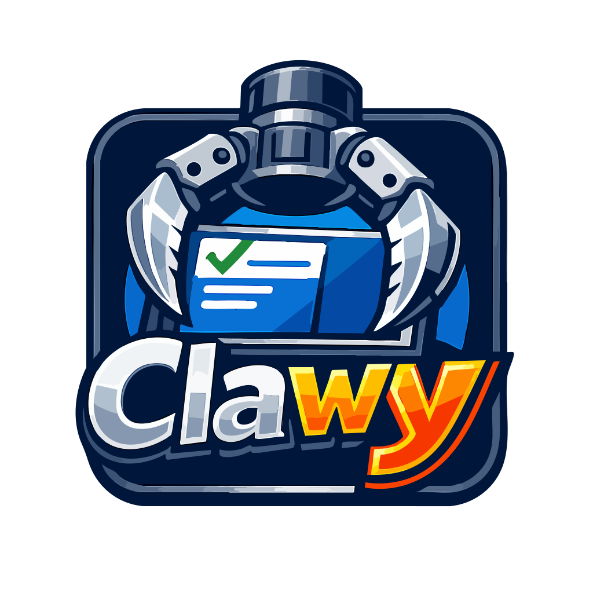

<p align="center">
  
</p>

<h1 align="center">Clawy</h1>

<p align="center">
  <strong>A lightweight Tauri desktop workspace for OpenClaw</strong>
</p>

<p align="center">
  <a href="#features">Features</a> •
  <a href="#why-clawy">Why Clawy</a> •
  <a href="#getting-started">Getting Started</a> •
  <a href="#architecture">Architecture</a> •
  <a href="#development">Development</a>
</p>

<p align="center">
  
  
  
  
  
</p>

<p align="center">
  English | <a href="README.zh-CN.md">简体中文</a> | <a href="README.ja-JP.md">日本語</a>
</p>

---

## Overview

**Clawy** is a Tauri-based desktop application built for the OpenClaw ecosystem. It turns OpenClaw's runtime, skills, providers, channels, and automation workflows into a focused desktop experience that is fast to start, easy to configure, and practical for daily use.

Compared with a traditional all-in-one desktop package, Clawy is designed around a lighter shell and a managed runtime model:

- the desktop app stays smaller and launches faster
- runtime dependencies can be prepared by the app itself
- OpenClaw can evolve independently from the desktop shell

The result is a cleaner upgrade path for users and a more maintainable desktop architecture for the project.

## Why Clawy

Clawy keeps the desktop layer lean while preserving the capabilities that matter in OpenClaw workflows.

| Problem | Clawy approach |
|---|---|
| Desktop packages grow too large | Use a lightweight Tauri shell to reduce package overhead |
| Cold start feels heavy | Native shell + WebView architecture improves startup responsiveness |
| Users should not prepare runtimes manually | Clawy can detect whether Node.js is available and prepare it automatically when missing |
| OpenClaw should not be tied to every desktop release | OpenClaw runtime can be provisioned by the app and updated independently |
| OpenClaw workflows are powerful but CLI-first | Providers, channels, skills, cron jobs, and chat are managed through a desktop UI |

## Features

### Lightweight desktop shell

Clawy is rebuilt with **Tauri**, which means lower shell overhead, smaller distribution size, and a snappier desktop feel than a heavy bundled-browser architecture.

### Fast startup and responsive UI

The desktop shell stays focused on windowing, system integration, and runtime orchestration, while OpenClaw continues to handle agent execution in its own runtime layer.

### Automatic runtime preparation

After launch, Clawy can check whether the required Node.js runtime is already available. If it is missing, Clawy can download and prepare it automatically instead of requiring a manual installation step.

### Managed OpenClaw service

Clawy is designed to provision the OpenClaw service automatically and keep it manageable as an independent runtime component. That makes it easier to ship desktop updates without forcing the entire OpenClaw stack to be replaced every time.

### Independent OpenClaw updates

Because the OpenClaw runtime can be managed independently, service updates can move faster and stay decoupled from desktop-shell iteration.

### Full desktop workflow for OpenClaw

Clawy provides a desktop interface for:

- chat sessions and history
- AI provider configuration
- skill browsing and installation
- channel management
- scheduled cron tasks
- runtime status, logs, and diagnostics

## Getting Started

### System Requirements

- macOS 11+, Windows 10+, or Linux
- 4 GB RAM minimum
- internet access for runtime bootstrap and updates

### Install

Download the latest package from the [Releases](https://github.com/edwardZhang/Clawy/releases) page.

### First Launch

On first launch, Clawy guides the user through setup and runtime checks.

Typical flow:

1. Select language and basic preferences
2. Detect whether the required runtime environment is already available
3. Automatically prepare Node.js if it is missing
4. Prepare or download the OpenClaw service runtime
5. Configure AI providers
6. Enter the main desktop workspace

### Proxy Support

Clawy includes built-in proxy settings for environments where the desktop runtime, the OpenClaw Gateway, or external channels must access the internet through a local proxy client.

Supported configuration includes:

- Proxy Server
- Bypass Rules
- HTTP Proxy
- HTTPS Proxy
- ALL_PROXY / SOCKS

Saving proxy settings reapplies the desktop proxy configuration and restarts the Gateway automatically.

## Architecture

Clawy follows a desktop-shell plus managed-runtime model:

```text
Clawy Desktop Shell (Tauri)
  -> window lifecycle, tray, updater, system integration
  -> runtime checks and bootstrap
  -> local settings, logs, diagnostics

Managed Runtime Layer
  -> Node.js runtime detection / download
  -> OpenClaw runtime provisioning
  -> versioned runtime management

OpenClaw Runtime
  -> gateway
  -> skills and plugins
  -> channels
  -> provider and agent orchestration
```

This split keeps the UI fast while allowing the OpenClaw runtime to evolve on its own cadence.

## Development

### Prerequisites

- Node.js 22+
- pnpm 10+
- Rust toolchain for Tauri builds

### Common Commands

```bash
pnpm run init          # install dependencies and prepare uv
pnpm dev               # start Vite + Tauri dev mode
pnpm run lint          # lint and auto-fix
pnpm run typecheck     # TypeScript checks
pnpm test              # unit tests
pnpm run build:tauri   # build desktop app
```

### Build From Source

```bash
git clone https://github.com/edwardZhang/Clawy.git
cd Clawy
pnpm run init
pnpm dev
```

## Acknowledgments

Clawy stands on the work of several excellent open-source projects:

- [OpenClaw](https://github.com/OpenClaw)
- [Tauri](https://tauri.app/)
- [React](https://react.dev/)
- [Zustand](https://github.com/pmndrs/zustand)

Clawy is also a Tauri-based reconstruction inspired by the original ClawX project. Special thanks to the ClawX developers for the original product direction and groundwork.

## License

Clawy is released under the [MIT License](LICENSE).
